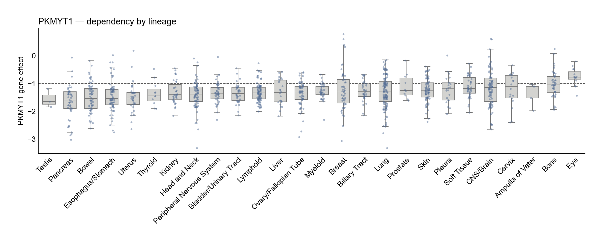
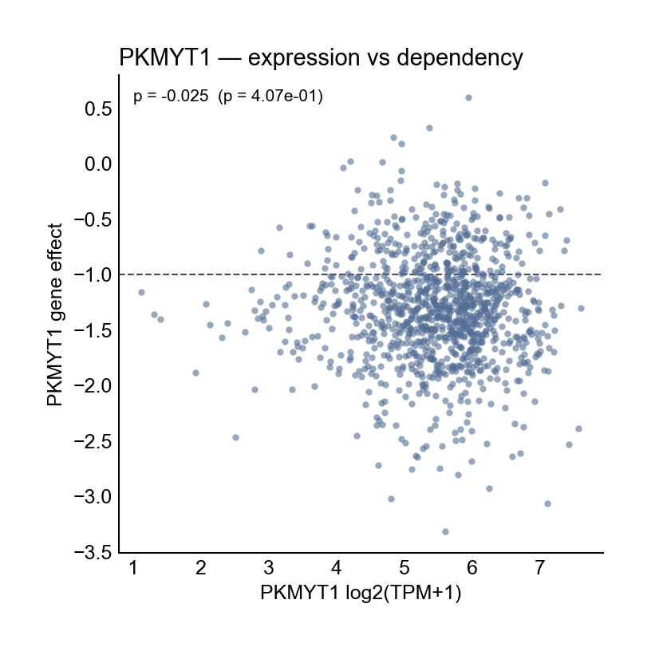

# depmap-db

Local DuckDB tooling for building, updating, querying, and plotting DepMap datasets.

This repository is designed to give you a **local, reproducible DepMap workspace** that can be used in three ways:

1. **CLI** for quick lookups and exports
2. **Python/Polars API** for notebook analysis and custom figures
3. **Figure API** for common plotting workflows already packaged in `depmap_db.plots`

It is intended to be usable by a new student without needing to understand the whole codebase first.

---

## What this project stores

The repository keeps each dataset in a structure close to its published form:

- **CRISPR gene effect** → `gene_effects_wide`
- **Gene expression** → `gene_expression_wide`
- **Somatic mutations** → `mutations` + derived `model_gene_mutation_status`
- **Proteomics (Gygi MS)** → `protein_expression_ms_wide` + `protein_features`
- **PRISM primary repurposing** → `drug_response_primary_wide` + `compounds` + `compound_targets`
- **PRISM secondary repurposing** → `drug_response_secondary` + `compounds` + `compound_targets` + `drug_screens`

### Why this matters

- Matrix-like assays such as CRISPR, expression, and proteomics are stored in **wide format**, because that is how DepMap distributes them and how most downstream analysis in this repo uses them.
- Mutations are stored in **long/event format**, because they are naturally event-based.
- PRISM data keeps the published primary/secondary structure rather than forcing everything into one abstraction too early.

---

## Repository layout

```text
src/depmap_db/         Python package
src/depmap_db/cli.py   Command-line interface
src/depmap_db/plots/   Figure API for common analysis plots
data/                  DuckDB database, cache, exported snapshots
notebooks/             Notebook work
reports/               Reports and exported outputs
tests/                 Test suite
```

Important default paths:

- Database: `data/depmap.duckdb`
- Download cache: `data/cache/`
- Polars snapshots: `data/polars/`
- Logs: `logs/`

---

# 1. Setup and installation

## Prerequisites

You need:

- **Python 3.13+**
- **uv** for environment and dependency management

If `uv` is not installed yet:

```bash
curl -LsSf https://astral.sh/uv/install.sh | sh
```

Or see the official uv installation instructions.

## Clone and install

```bash
git clone <repo-url>
cd depmap-db
uv venv
source .venv/bin/activate
uv sync
```

This installs the CLI entry point `depmap-db` and the Python package `depmap_db` into the virtual environment.

## Configuration

A template config file is included as `.env.template`.

Recommended first step:

```bash
cp .env.template .env
```

The defaults are sensible for local use. The most important settings are:

```env
DEPMAP_DATABASE__PATH=data/depmap.duckdb
DEPMAP_DEPMAP__CACHE_DIR=data/cache
DEPMAP_DEPMAP__RELEASE_LABEL=DepMap Public 25Q3
```

If you keep the defaults, the repository stays self-contained and all local data lives under `data/`.

---

# 2. First-time setup: from empty repo to working database

For a new student, the safest first build sequence is:

## Step 1 — Activate the environment

```bash
cd depmap-db
source .venv/bin/activate
```

## Step 2 — Initialize the DuckDB schema

```bash
depmap-db init
```

This creates the empty database schema.

## Step 3 — Download the default phase-1 datasets

```bash
depmap-db download
```

This downloads the default supported dataset set into the cache.

## Step 4 — Load downloaded data into the database

The easiest route is to combine downloading and loading in one command:

```bash
depmap-db download --load-data
```

If you already downloaded the files previously, load them from the cache folder instead:

```bash
depmap-db load-folder --folder data/cache
```

## Step 5 — Check that the database looks healthy

```bash
depmap-db status
```

This should show:

- database path
- schema version
- release tracking information (if refresh has been used)
- available tables and row counts

---

# 3. Data download and refresh procedures

This is the section most students will actually need.

## A. Fresh download for a new machine

Use this when setting up from scratch:

```bash
depmap-db init
depmap-db download --load-data
depmap-db status
```

## B. Download only specific datasets

Use this when you only need a subset:

```bash
depmap-db download \
  --datasets Model \
  --datasets Gene \
  --datasets CRISPRGeneEffect \
  --load-data
```

## C. Load a folder of already-downloaded CSV files

Use this when you have files from DepMap or a collaborator on disk already:

```bash
depmap-db load-folder --folder /path/to/depmap/files
```

You can also force a reload:

```bash
depmap-db load-folder --folder /path/to/depmap/files --force
```

## D. Plan a release refresh without changing anything

Use this first if you want to see what would happen:

```bash
depmap-db refresh --datasets Model --datasets Gene
```

That gives a refresh plan only.

## E. Apply a release refresh

Use this when the configured release label has changed and you want to update local data:

```bash
depmap-db refresh \
  --datasets Model \
  --datasets Gene \
  --apply \
  --load-data
```

If you want to force reload the refreshed data into DuckDB:

```bash
depmap-db refresh \
  --datasets Model \
  --datasets Gene \
  --apply \
  --load-data \
  --force
```

## Recommended update workflow

For routine maintenance:

1. Update `DEPMAP_DEPMAP__RELEASE_LABEL` in `.env` when moving to a new DepMap release.
2. Check the plan first:
   ```bash
   depmap-db refresh --datasets Model --datasets Gene
   ```
3. Apply the refresh:
   ```bash
   depmap-db refresh --datasets Model --datasets Gene --apply --load-data
   ```
4. Verify the result:
   ```bash
   depmap-db status
   ```

## PRISM-specific download example

```bash
depmap-db download \
  --datasets PRISMPrimaryRepurposingExtended \
  --datasets PRISMSecondaryDoseResponseCurveParameters
```

Then load local PRISM files:

```bash
depmap-db load-folder --folder /path/to/depmap/prism/files
```

---

# 4. Quick-start command cheat sheet

```bash
# initialise database
depmap-db init

# see database status
depmap-db status

# download default datasets
depmap-db download

# download and load into the database
depmap-db download --load-data

# load local files
depmap-db load-folder --folder /path/to/files

# plan a refresh
depmap-db refresh --datasets Model --datasets Gene

# apply a refresh
depmap-db refresh --datasets Model --datasets Gene --apply --load-data

# run a gene dependency summary
depmap-db gene dependency-summary HAPSTR1 --group-by lineage --limit 10

# inspect mutations in one model
depmap-db model mutations DLD-1 --gene KRAS

# export a dataset
depmap-db export -o matched --data-type joint
```

---

# 5. Step-by-step usage via the CLI

The CLI is the fastest way to ask focused biological questions without opening Python.

## Step 1 — Check the database is ready

```bash
depmap-db status
```

If the database has not been initialized yet, run:

```bash
depmap-db init
```

If tables are missing, download/load data first.

## Step 2 — Ask a simple gene question

### Which lineages are most dependent on a gene?

```bash
depmap-db gene dependency-summary HAPSTR1 --group-by lineage --limit 10
```

### Which diseases are most dependent on a gene?

```bash
depmap-db gene dependency-summary HAPSTR1 --group-by disease --limit 10
```

### Which lineages express a gene most strongly?

```bash
depmap-db gene expression-summary HAPSTR1 --group-by lineage --limit 10
```

## Step 3 — Get per-model values

### Show per-model dependency values

```bash
depmap-db gene dependency-models MASTL --lineage Breast
```

### Export those values to CSV

```bash
depmap-db gene dependency-models MASTL \
  --lineage Breast \
  --output mastl_breast.csv
```

### Change output format

```bash
depmap-db gene dependency-models MASTL --format json
```

Supported formats are:

- `table`
- `csv`
- `json`

## Step 4 — Stratify dependency by mutation status

Example: compare KRAS dependency between TP53-mutant and TP53-wild-type lung models:

```bash
depmap-db gene dependency-by-mutation KRAS \
  --mutation-gene TP53 \
  --mutation-class driver \
  --lineage Lung
```

Mutation classes currently supported:

- `any`
- `likely_lof`
- `hotspot`
- `driver`

## Step 5 — Inspect model mutations

```bash
depmap-db model mutations DLD-1 --gene KRAS
```

Useful filters:

```bash
depmap-db model mutations DLD-1 --lof-only
depmap-db model mutations DLD-1 --hotspot-only
depmap-db model mutations DLD-1 --driver-only
```

## Step 6 — Check mutation frequency in a lineage

```bash
depmap-db lineage mutation-frequency Lung --limit 20
```

## Step 7 — Use proteomics helpers

### Check how well proteins map to genes

```bash
depmap-db protein mapping-summary
```

### Search the proteomics bridge

```bash
depmap-db protein search RBM47
```

### Summarise protein abundance by lineage

```bash
depmap-db protein expression-summary A0AV96 --group-by lineage --limit 10
```

## Step 8 — Export analysis tables

### Export expression

```bash
depmap-db export -o expression.csv --data-type expression
```

### Export CRISPR dependency

```bash
depmap-db export -o crispr.csv --data-type crispr
```

### Export integrated data for selected genes

```bash
depmap-db export -o tp53_myc.csv --data-type integrated --genes TP53,MYC
```

### Export perfectly matched expression and CRISPR matrices

```bash
depmap-db export -o matched --data-type joint
```

This writes:

- `matched_expression.csv`
- `matched_crispr.csv`

## Step 9 — Run raw SQL if needed

```bash
depmap-db sql --sql "SELECT COUNT(*) FROM models"
```

Or from a file:

```bash
depmap-db sql --file query.sql --format table
```

---

# 6. Step-by-step usage via the Figure API

The project also exposes a proper Python plotting layer under:

```python
import depmap_db.plots as plots
```

This is the easiest route if you want publication-style exploratory plots without writing everything from scratch.

## Figure API pattern

Most plotting helpers in `depmap_db.plots` follow a three-layer design:

1. `analyse_*()` → returns a DataFrame used for plotting
2. `plot_*()` → plots a supplied DataFrame
3. a convenience wrapper (for example `expr_vs_dep()` or `lineage_analysis()`) → does both in one step and returns a Matplotlib figure

That means you can either:

- do everything in one line, or
- split analysis and plotting when you want to inspect or modify the intermediate data

For some plot families, the convenience function is what is exported at the top level; if you want the lower-level analysis helper, import it from the specific module inside `depmap_db.plots`.

## Step 1 — Open Python or a notebook

```bash
uv run python
```

Or start Jupyter/Marimo in the activated environment.

## Step 2 — Import the plotting API

```python
import depmap_db.plots as plots
import matplotlib.pyplot as plt
```

If you want to point to a non-default database file, keep a path handy:

```python
DB = "data/depmap.duckdb"
```

## Step 3 — Make a lineage plot

### One-step version

```python
fig = plots.lineage_analysis("MASTL", assay="dependency", db_path=DB)
fig.savefig("mastl_by_lineage.png", dpi=300, bbox_inches="tight")
```

### Split analysis and plotting

```python
from depmap_db.plots.lineage_plots import analyse_by_lineage
from depmap_db.plots import plot_lineage

df = analyse_by_lineage("MASTL", assay="dependency", db_path=DB)
fig, ax = plot_lineage(df, gene="MASTL", assay="dependency")
```

Use `assay="expression"` for expression instead of dependency.

## Step 4 — Plot expression versus dependency for one gene

```python
fig = plots.expr_vs_dep("HAPSTR1", db_path=DB)
fig.savefig("hapstr1_expr_vs_dep.png", dpi=300, bbox_inches="tight")
```

Optional coloring by lineage:

```python
fig = plots.expr_vs_dep(
    "HAPSTR1",
    color_by="lineage",
    db_path=DB,
)
```

Optional coloring by mutation status:

```python
fig = plots.expr_vs_dep(
    "KRAS",
    color_by="mutation",
    mutation_gene="TP53",
    gene_type="suppressor",
    db_path=DB,
)
```

## Step 5 — Build a biomarker volcano plot

```python
fig = plots.biomarker_volcano("KRAS", db_path=DB)
fig.savefig("kras_biomarker_volcano.png", dpi=300, bbox_inches="tight")
```

If you want the underlying table first:

```python
df = plots.analyse_biomarker_volcano("KRAS", db_path=DB)
fig, ax = plots.plot_biomarker_volcano(df, target_gene="KRAS")
```

## Step 6 — Use other prebuilt plot families

The package exports additional plot helpers for:

- lineage plots
- mutation comparison
- gene–gene scatter plots
- top-correlation plots
- expression-vs-dependency plots
- biomarker volcano plots
- drug-by-lineage plots
- drug-by-mutation plots
- drug–dependency scatter plots
- mutation waterfall plots
- co-mutation plots
- selectivity plots
- gene heatmaps

Explore what is available with:

```python
import depmap_db.plots as plots
print(dir(plots))
```

---

# 7. Step-by-step usage via the Polars/Python API

If the Figure API does not quite match the figure you want, use the lower-level Python API and make the figure yourself.

## Two ways to get data into Polars

`depmap_db.polars` exposes two different styles:

### A. Direct scan API

This queries DuckDB directly and returns a Polars `LazyFrame`.

Use this for:

- interactive work
- notebooks
- always-current data

### B. Lazy Parquet snapshot API

This exports Parquet snapshots first, then reopens them lazily.

Use this for:

- sharing data with others
- working offline
- caching analysis-ready datasets

## Step 1 — Import the scan API

```python
from depmap_db import scan_models, scan_gene_effects_wide
```

## Step 2 — Query a table directly

```python
models = scan_models(db_path=DB)
crispr = scan_gene_effects_wide(db_path=DB)

print(models.select(["model_id", "cell_line_name", "oncotree_lineage"]).limit(5).collect())
```

## Step 3 — Use curated datasets for analysis-ready tables

```python
from depmap_db import scan_proteomics_long, scan_mutation_events

proteomics = scan_proteomics_long(db_path=DB)
mutations = scan_mutation_events(db_path=DB)
```

Example join:

```python
import polars as pl

rbm47_tp53 = (
    proteomics
    .filter(pl.col("gene_symbol") == "RBM47")
    .join(
        mutations
        .filter(pl.col("gene_symbol") == "TP53")
        .select(["model_id", "protein_change", "hotspot"]),
        on="model_id",
        how="left",
    )
)

print(rbm47_tp53.limit(10).collect())
```

## Step 4 — Export lazy Parquet snapshots

From the CLI:

```bash
depmap-db polars export --table models --table mutations
```

Or curated datasets:

```bash
depmap-db polars export \
  --dataset proteomics_long \
  --dataset mutation_events \
  --dataset drug_primary_long \
  --dataset drug_secondary_enriched
```

## Step 5 — Reopen snapshots lazily in Python

```python
from depmap_db import get_lazy_datasets, get_lazy_tables

frames = get_lazy_datasets(datasets=["proteomics_long", "drug_primary_long"])
tables = get_lazy_tables(tables=["models", "mutations"])
```

## Step 6 — Prepare snapshots and open them in one step

```python
from depmap_db import prepare_lazy_datasets

frames = prepare_lazy_datasets(
    datasets=["proteomics_long", "mutation_events"],
    db_path=DB,
)
```

---

# 8. Supported Polars surfaces

## Raw tables

- `models`
- `genes`
- `protein_features`
- `compounds`
- `compound_targets`
- `drug_screens`
- `gene_effects_wide`
- `gene_expression_wide`
- `protein_expression_ms_wide`
- `drug_response_primary_wide`
- `drug_response_secondary`
- `drug_response_secondary_dose`
- `mutations`
- `model_gene_mutation_status`

## Curated datasets

- `mutation_events`
- `proteomics_long`
- `drug_primary_long`
- `drug_secondary_enriched`

---

# 9. Common student workflows

## Workflow 1 — “I want to know whether a gene looks selective”

1. Check lineage-level dependency:
   ```bash
   depmap-db gene dependency-summary MASTL --group-by lineage --limit 10
   ```
2. Export model-level values:
   ```bash
   depmap-db gene dependency-models MASTL --output mastl_models.csv
   ```
3. Make a lineage plot in Python:
   ```python
   fig = plots.lineage_analysis("MASTL", assay="dependency", db_path=DB)
   ```

## Workflow 2 — “I want to compare dependency with mutation state”

1. Check mutation frequency in a lineage:
   ```bash
   depmap-db lineage mutation-frequency Lung --limit 20
   ```
2. Compare dependency by mutation status:
   ```bash
   depmap-db gene dependency-by-mutation KRAS --mutation-gene TP53 --lineage Lung
   ```
3. Inspect mutation events in representative lines:
   ```bash
   depmap-db model mutations DLD-1 --gene TP53
   ```

## Workflow 3 — “I want to generate a figure for a notebook or manuscript draft”

1. Start with the Figure API:
   ```python
   fig = plots.expr_vs_dep("HAPSTR1", db_path=DB)
   ```
2. If that is too rigid, switch to the Polars scan API:
   ```python
   from depmap_db import scan_gene_effects_wide, scan_gene_expression_wide
   ```
3. Build the custom figure in Matplotlib/Seaborn.

---

# 10. Validation and development checks

Run the standard checks before committing changes:

```bash
uv run pytest
uv run ruff check .
uv run mypy src
```

---

# 11. Notes and caveats

- `depmap-db init` creates the schema but does **not** download data.
- `depmap-db download` downloads files but only loads them into DuckDB if you also pass `--load-data`.
- `refresh` is the right tool for repeatable release-aware updates.
- The Polars API requires a **file-backed** DuckDB database for snapshot export; in-memory databases are not suitable for lazy Parquet export.
- Some figure helpers scan large tables and may be slow on the first run.

---

# 12. Minimal first-day checklist for a student

If you only remember one sequence, remember this:

```bash
cp .env.template .env
uv venv
source .venv/bin/activate
uv sync
depmap-db init
depmap-db download --load-data
depmap-db status
```

Then try:

```bash
depmap-db gene dependency-summary HAPSTR1 --group-by lineage --limit 10
```

And in Python:

```python
import depmap_db.plots as plots
fig = plots.lineage_analysis("HAPSTR1", assay="dependency", db_path="data/depmap.duckdb")
```

---

# 13. Worked PKMYT1 example with generated figures

For a concrete example, the repository now includes a small notebook-style script:

- `notebooks/pkmyt1_example.py`

Run it with:

```bash
uv run python notebooks/pkmyt1_example.py
```

By default it uses the local DuckDB file at:

```text
~/.depmap/depmap.duckdb
```

and writes figure assets to:

```text
reports/readme_assets/
```

It currently generates two example PKMYT1 plots:

1. **Lineage-level dependency**
2. **Expression versus dependency scatter**

### PKMYT1 lineage-level dependency

This is useful as a first-pass view of which lineages look especially sensitive to PKMYT1 loss.



### PKMYT1 expression versus dependency

This gives a quick biomarker-style view of whether higher PKMYT1 expression tracks with stronger dependency.



### Source code used for the example

```python
import depmap_db.plots as plots
from pathlib import Path

DB_PATH = Path.home() / ".depmap" / "depmap.duckdb"

fig = plots.lineage_analysis("PKMYT1", assay="dependency", db_path=DB_PATH)
fig.savefig("reports/readme_assets/pkmyt1_lineage_dependency.png", dpi=300, bbox_inches="tight")

fig = plots.expr_vs_dep("PKMYT1", db_path=DB_PATH)
fig.savefig("reports/readme_assets/pkmyt1_expr_vs_dep.png", dpi=300, bbox_inches="tight")
```
